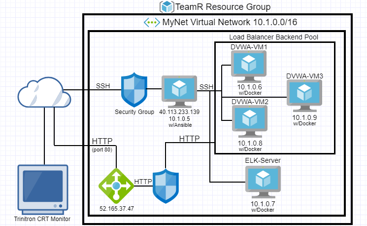

## Automated ELK Stack Deployment

The files in this repository were used to configure the network depicted below.

These files have been tested and used to generate a live ELK deployment on Azure. They can be used to either recreate the entire deployment pictured above. Alternatively, select portions of the playbook file may be used to install only certain pieces of it, such as Filebeat.

  -[Playbook File](https://github.com/JBlandina/Elk/blob/master/Ansible/ELK/install-elk.yml)

This document contains the following details:
- Description of the Topology
- Access Policies
- ELK Configuration
  - Beats in Use
  - Machines Being Monitored
- How to Use the Ansible Build

### Description of the Topology

The main purpose of this network is to expose a load-balanced and monitored instance of DVWA, the D*mn Vulnerable Web Application.

Load balancing ensures that the application will be highly responsive, in addition to restricting traffic to the network.
- _TODO: What aspect of security do load balancers protect? What is the advantage of a jump box?_

Integrating an ELK server allows users to easily monitor the vulnerable VMs for changes to the log data and system metrics.
- Filebeat monitors log files.
- Metricbeat records metrics for servers.

The configuration details of each machine may be found below.

| Name     | Function | IP Address | Operating System |
|----------|----------|------------|------------------|
| JumpBox  | Gateway  | 10.1.0.5   | Linux            |
| DVWA-VM1 |          | 10.1.0.6   | Linux            |
| Elk      |          | 10.1.0.7   | Linux            |
| DVWA-VM2 |          | 10.1.0.8   | Linux            |
| DVWA-VM3 |          | 10.1.0.9   | Linux            |
### Access Policies

The machines on the internal network are not exposed to the public Internet. 

Only the Jumpbox machine can accept connections from the Internet. Access to this machine is only allowed from the following IP addresses:
- 10.1.0.6
  10.1.0.7
  10.1.0.8
  10.1.0.9
  
Machines within the network can only be accessed by JumpBox.
-JumpBox was allowed to connect to ELK VM

A summary of the access policies in place can be found in the table below.

| Name     | Publicly Accessible | Allowed IP Addresses |
|----------|---------------------|----------------------|
| Jump Box | Yes/No              | 10.0.0.1 10.0.0.2    |
|          |                     |                      |
|          |                     |                      |

### Elk Configuration

Ansible was used to automate configuration of the ELK machine. No configuration was performed manually, which is advantageous because...
- Ansible is easy to use, streamlines and simplifies cloud provisioning, configuration management, and application deployment.

The playbook implements the following tasks:
- Install docker.io_TODO: In 3-5 bullets, explain the steps of the ELK installation play. E.g., install Docker; download image; etc._
- Install pip
- Install Docker python module
- Increase virtual memory
-download and launch a docker elk container

The following screenshot displays the result of running `docker ps` after successfully configuring the ELK instance.

### Target Machines & Beats
This ELK server is configured to monitor the following machines:
- 10.1.0.6
  10.1.0.8
  10.1.0.9

We have installed the following Beats on these machines:
- Filebeat and Metricbeat

These Beats allow us to collect the following information from each machine:
- Filebeat collects various log data from servers including Winlogbeat which is used to trach login events. Metricbeat is here to monitor various metrics in our servers such as uptime of a machine.

### Using the Playbook
In order to use the playbook, you will need to have an Ansible control node already configured. Assuming you have such a control node provisioned: 

SSH into the control node and follow the steps below:
- Copy the filebeat config file to the ELK VM.
- Update the configuration file to include the correct remote_user
- Run the playbook, and navigate to filebeat installation page on the ELK server GUI to check that the installation worked as expected.

_TODO: Answer the following questions to fill in the blanks:_
- _Which file is the playbook? Where do you copy it?_
- Edit the host file to run the playbook on a specific machine. Changing the IP will specific which machine to install.
- http://104.43.239.148:5601

_As a **Bonus**, provide the specific commands the user will need to run to download the playbook, update the files, etc._
